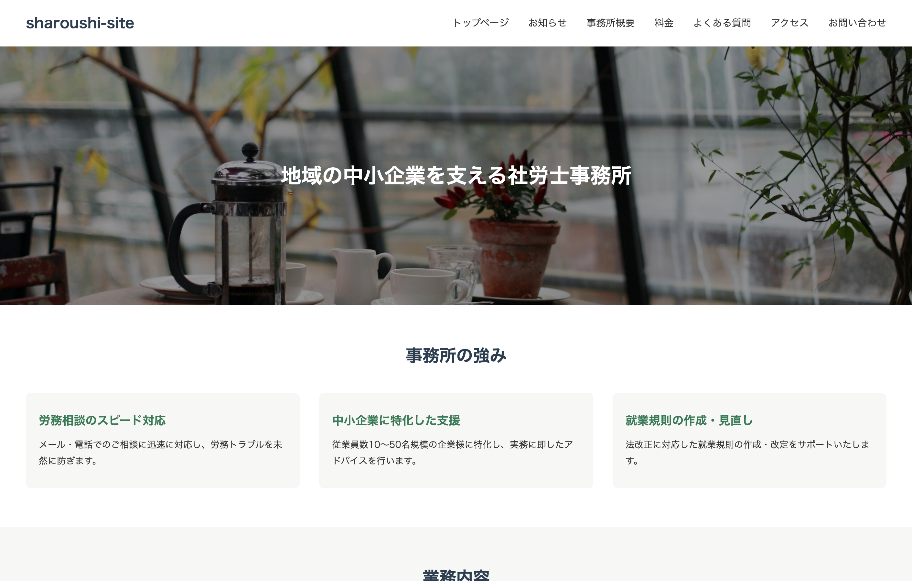
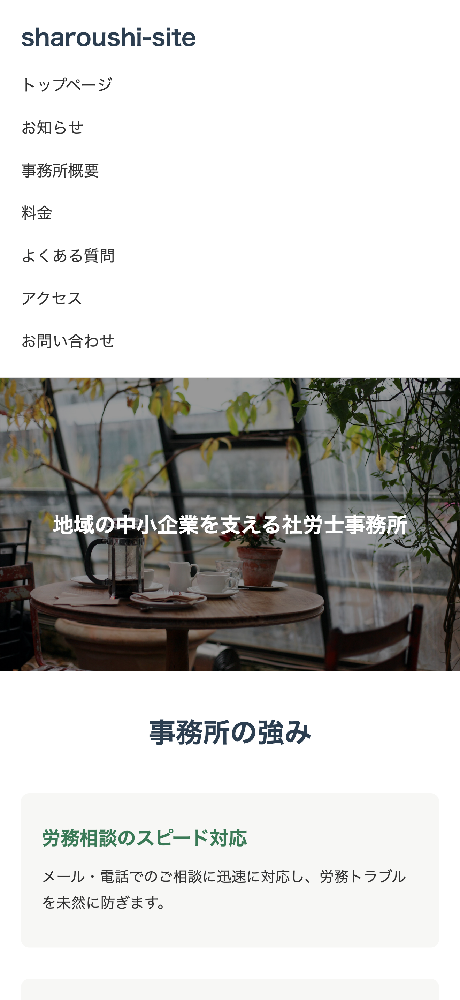

# sharoushi-theme

社会保険労務士事務所を想定した、WordPressオリジナルテーマです。
士業のコーポレートサイトとして、企画・設計から実装まで一貫して制作しました。

## 公開URL

※本リポジトリ(`sharoushi-theme`)はWordPressテーマのソースコードです。上記URLの静的公開用ファイルは`docs`フォルダで管理しています。

https://coda-webcraft.github.io/sharoushi-theme/

## スクリーンショット

| PC | スマホ |
|---|---|
|  |  |

## 制作背景

Web制作の学習・ポートフォリオ用に、架空の社労士事務所「社会保険労務士法人あおはた」のコーポレートサイトとして制作しました。

## 主な機能

- WordPressオリジナルテーマ(header/footer共通化、functions.phpでの機能設定)
- ACF(Advanced Custom Fields)を使ったカスタムフィールド設計
- カスタムページテンプレート(事務所概要、料金、業務詳細、よくある質問、アクセス、お問い合わせ)
- 業務詳細ページの共通テンプレート化(4ページで1テンプレートを使い回し)
- 投稿機能を使った「お知らせ」ページ(一覧・個別記事)
- トップページへのカスタムクエリ(WP_Query)によるお知らせ表示
- Contact Form 7を使ったお問い合わせフォーム
- レスポンシブ対応(メディアクエリ)


## ディレクトリ構成

```
sharoushi-theme/
├── docs/                    # GitHub Pages公開用(静的サイト)
├── screenshots/             # README用スクリーンショット
├── about.php                # 事務所概要ページ
├── access.php               # アクセスページ
├── archive.php              # お知らせ一覧
├── contact.php              # お問い合わせページ
├── faq.php                  # よくある質問ページ
├── footer.php
├── front-page.php           # トップページ
├── functions.php
├── header.php
├── home.php                 # お知らせ一覧(投稿ページ)
├── index.php
├── price.php                # 料金ページ
├── service-detail.php       # 業務詳細(共通テンプレート)
├── single.php                # お知らせ個別記事
├── style.css
└── README.md
```

## 使用技術

- WordPress
- PHP
- ACF(Advanced Custom Fields)
- Contact Form 7
- HTML / CSS


## 制作者・制作環境

- 制作者：coda.
- 制作環境：Local(ローカル開発環境)